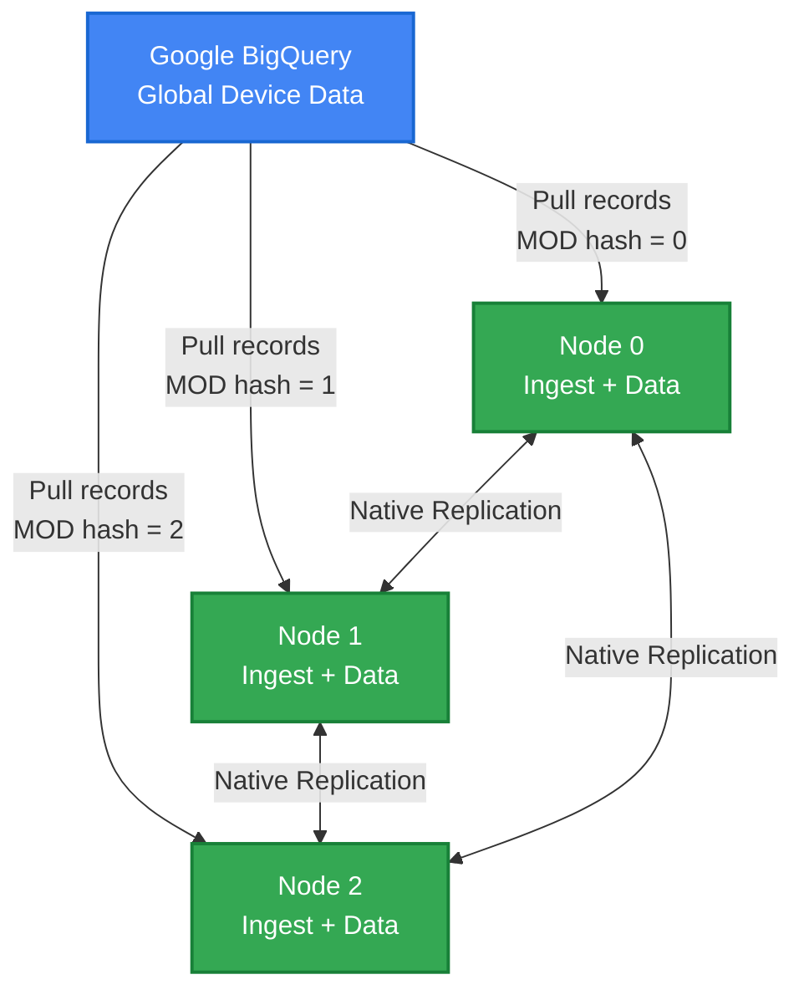

# Ingesting Massive Data into Harper: Why Simple Solutions Fail

**The bottom line:** A distributed architecture was developed that scales linearly—without coordination overhead—evolving from a single-process bottleneck.

**About Harper:** A distributed platform unifying database, cache, and application server. [Learn more](https://harperdb.io)

---

## The Challenge

**The problem:** Syncing massive, real-time datasets from Google BigQuery into Harper—from a global network of devices updating continuously.

**Why it matters:** The "obvious" solutions don't scale. Here's what was learned.

---

## Attempt 1: Single Process Bottleneck

**The approach:** Simple polling loop with DNS load balancing to Harper nodes.

```
LOOP forever:
  query BigQuery for new records
  write each record to Harper (DNS load balanced)
  checkpoint last timestamp
END
```

**Why it failed:** The bottleneck was pulling FROM BigQuery, not writing TO Harper.

**Key issues:**
- One process = one API client = hard rate limits
- No parallelism in BigQuery queries
- Single point of failure
- Adding Harper nodes helped writes but not ingestion

**Time to abandonment:** 30 minutes.

**The lesson:** Distribution must start at the SOURCE, not just the destination.

---

## Attempt 2: Global Lock Coordination

**The approach:** Multiple nodes compete for a global lock—only the winner ingests.

```
LOOP forever:
  IF acquire lock:
    query BigQuery, write to local Harper
    release lock
  ELSE:
    wait and retry
END
```

**The upside:** Automatic failover. Prevents duplicate BigQuery queries (wasted cost) and writes (wasted IOPS).

**Why it failed:** Still no parallelism. Worse—operational complexity exploded.

**The hidden costs of "simple" locks:**
- Which node gets the lock? (consensus problem)
- Crashed holder vs. slow holder? (timeout tuning nightmare)
- Network partition = split-brain scenarios
- Zombie processes with stale locks
- Lock service becomes critical dependency (Redis/ZK failure = total outage)
- Lock contention overhead

**The paradox:** The architecture was distributed to enable parallel work, then a lock was added to prevent parallel work.

**The lesson:** When cycles are spent deciding who gets to work, no work gets done. Real question: can correctness AND parallelism coexist?

---

## The Solution: Modulo-Based Partitioning

**The breakthrough:** What if each node independently knows which records to ingest?

### Core Concept

Hash each record's timestamp, modulo by cluster size:

```javascript
nodeId = hash(record.timestamp) % clusterSize
```

**In practice:** Node 0 in a 3-node cluster pulls only `hash(timestamp) % 3 == 0` records.

**The beauty:** Zero coordination. Each node queries BigQuery for just its partition:

```sql
SELECT * FROM `project.dataset.table`
WHERE MOD(ABS(FARM_FINGERPRINT(CAST(timestamp AS STRING))), 3) = 0
  AND timestamp > @lastCheckpoint
ORDER BY timestamp ASC LIMIT 1000
```

Node 0: `= 0` | Node 1: `= 1` | Node 2: `= 2`

### How It Works

**1. Node Discovery**

Harper's native clustering API ([docs](https://docs.harperdb.io/docs/developers/replication)) enables peer discovery:

```javascript
const nodes = await harperCluster.getNodes();
const sorted = nodes.sort((a, b) => a.id.localeCompare(b.id));
const myNodeId = sorted.findIndex(n => n.id === harperCluster.currentNode.id);
```

Deterministic sorting = consistent partition assignments across all nodes.

**On [Fabric](https://fabric.harper.fast):** Clustering is automatic—zero manual configuration.

**2. Partitioned Polling**

Modulo filtering happens in BigQuery—unnecessary data is never pulled:

```javascript
const query = `
  SELECT * FROM \`table\`
  WHERE MOD(ABS(FARM_FINGERPRINT(CAST(timestamp AS STRING))), ${clusterSize}) = ${myNodeId}
    AND timestamp > @checkpoint
  ORDER BY timestamp ASC LIMIT ${batchSize}
`;
```

**3. Local Writes + Checkpoints**

```javascript
await harperTable.putBatch(records);
await checkpointTable.put({
  nodeId: myNodeId,
  lastTimestamp: records[records.length - 1].timestamp,
  recordsIngested: totalIngested
});
```

**4. Native Replication**

Harper automatically replicates across nodes ([docs](https://docs.harperdb.io/docs/developers/replication))—no custom replication logic is needed.

### Adaptive Batching

Batch size adjusts to lag:

```javascript
function calculateBatchSize(lag) {
  if (lag > 3600) return 10000;  // Hours behind
  if (lag > 300) return 1000;     // Minutes behind
  return 500;                     // Near real-time
}
```

**Result:** Fast initial sync, efficient steady-state.

---

## Architecture Overview



**Each node independently:**
- Discovers cluster topology
- Calculates its partition
- Polls BigQuery for its partition only
- Writes locally
- Relies on Harper's native replication

---

## Why This Works

**No coordination overhead**
- Zero inter-node communication for ingestion
- No locks, leader election, or consensus
- Just independent, parallel work

**Linear scalability**
- 3 nodes = 3x throughput
- 6 nodes = 6x throughput
- Each handles 1/n of data

**Independent failure recovery**
- Node crashes? Others keep running
- Crashed node restarts from last checkpoint
- Zero cluster-wide impact

**Predictable performance**
- No variable coordination latency
- Performance = f(partition size, BigQuery response time)

---

## The Trade-Off: Node Stability

**The constraint:** Cluster topology must be relatively stable.

**Why:** Adding/removing nodes changes the modulo (`hash % 3` → `hash % 4`), remapping timestamps to different nodes.

### Production Hardening

**1. Fixed Node IDs**

```yaml
clustering:
  nodeId: node-001  # Never changes
  peers: [node-001, node-002, node-003]
```

Restarts preserve ID and partition ownership.

**2. Overprovision 2x**

```
Deployed nodes = (peak load capacity) × 2
```

Quarterly capacity planning replaces frequent topology changes.

**3. Essential Monitoring**

- Drift: `|bq_count - harper_count| > 1000` for 5+ min
- Lag: >30 min behind BigQuery
- Dead node: No checkpoint update in 5 min
- Phase dashboard: Catchup vs. steady-state tracking

**4. Operational Runbooks**

- Node addition procedure (brief pause for rebalancing)
- Failure recovery (crash, network partition, timeout)
- Quarterly capacity reviews

**5. Monthly Chaos Testing**

- Kill random nodes → verify checkpoint recovery
- Force restarts → validate checkpoint integrity
- Inject corruption → test drift detection

**Future:** Automatic rebalancing protocol (detect change → pause → recalculate → resume). Not needed yet—on roadmap if dynamic scaling becomes critical.

---

## Validation & Monitoring

**Challenge:** Harper's `count()` returns estimates with inconsistent ranges—unreliable for validation.

**Solution:** Three-pronged validation without counts:

**1. Progress monitoring** — Alert if checkpoints stop updating (10+ min)

**2. Smoke tests** — Query recent data every 5 min, verify it's queryable and fresh

**3. Spot checks** — Randomly verify 5-10 records exist in both BigQuery and Harper

**Key metrics:**
- **Lag:** Seconds behind BigQuery
- **Throughput:** Records/sec per node
- **Phase:** Initial | Catchup | Steady
- **Checkpoint freshness:** Last update time
- **Spot check pass rate:** Validated vs. mismatches
- **Error rate:** Failed batches/min

---

## Implementation Details

**Schema:**

```graphql
type BigQueryData @table {
  id: ID! @primaryKey
  timestamp: String! @indexed
  deviceId: String @indexed
  data: Any
  _syncedAt: String @createdTime
}

type SyncCheckpoint @table {
  nodeId: Int! @primaryKey
  lastTimestamp: String!
  recordsIngested: Long!
  phase: String!  # initial | catchup | steady
}

type SyncAudit @table {
  id: ID! @primaryKey
  timestamp: String! @indexed
  nodeId: Int!
  bigQueryCount: Long!
  harperCount: Long!
  delta: Long!
  status: String!
}
```

**Error handling:**

```javascript
async function ingestBatch(records) {
  try {
    await harperTable.putBatch(records);
    await updateCheckpoint(records[records.length - 1].timestamp);
  } catch (error) {
    if (isRetriable(error)) {
      await sleep(exponentialBackoff());
      return ingestBatch(records);
    }
    logger.error('Unrecoverable', { error, records });
    // Skip, continue
  }
}
```

**Data validation:**

```javascript
for (const record of records) {
  if (!record.timestamp) {
    await audit.logSkipped(record, 'missing_timestamp');
    continue;
  }
  // Process
}
```

---

## Performance Results

**Throughput** (3 nodes, modest hardware):
- Steady: 15K records/sec total (5K per node)
- Catchup: 30K records/sec (10K per node)

**Latency:**
- Steady-state lag: <30 sec
- Initial sync: 6 hours for 100M records
- Catchup from 1hr lag: 10 min

**IOPS** (2 indexes):
- 4 IOPS per record
- 5K records/sec/node = 20K IOPS
- SSD handles comfortably

---

## Key Takeaways

1. **Distribution > Coordination** — Every cycle spent coordinating is a cycle not working.

2. **Deterministic Partitioning is Powerful** — When nodes independently calculate correct answers, communication becomes unnecessary.

3. **Leverage Native Capabilities** — Harper's battle-tested clustering and replication beat custom implementations.

4. **Adaptive Behavior Matters** — Static configurations waste resources or leave performance on the table.

5. **Trade-offs are Acceptable** — Node stability vs. flexibility is fine. Most systems don't need minute-by-minute autoscaling.

---

## When to Use This Pattern

**✅ Good fit:**
- Large, continuously updating datasets
- Horizontal scalability requirements
- Stable cluster topology
- Source supports partitioned queries

**❌ Poor fit:**
- Minute-by-minute autoscaling needs
- Immediate strong consistency requirements
- Source lacks efficient partition support

---

## Conclusion

**The key insight:** Make partition assignment a pure function of the data, not a stateful coordination process.

Distributed ingestion doesn't require complex coordination protocols. With deterministic partitioning, nodes work independently while the system scales linearly.

This pattern applies beyond BigQuery and Harper—anywhere you need large-scale data ingestion into distributed systems. Modulo-based partitioning is simple, predictable, and scales beautifully.

**Sometimes the best distributed algorithm is no coordination at all.**

---

## Get Started

**Try Harper Fabric:** [fabric.harper.fast](https://fabric.harper.fast) — Deploy globally distributed applications with built-in sync. Free tier, no credit card.

**Need help?** The team at Harper is ready to discuss data ingestion challenges.

**Resources:**
- [Design Document](#) — Full technical details
- [GitHub Repository](#) — Complete implementation
- [HarperDB Docs](https://docs.harperdb.io) — Platform documentation