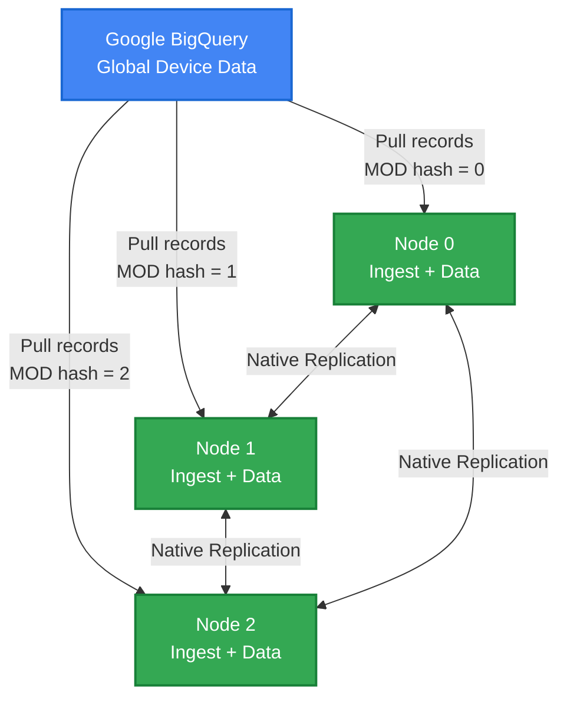

# Scaling BigQuery to Harper Ingestion: Why Simple Solutions Don't Work and What Does

*How we evolved from a single-process bottleneck to a distributed architecture that scales linearly*

**About Harper:** Harper is a distributed application platform that unifies database, cache, and application server into a single system. [Learn more at harperdb.io](https://harperdb.io)

---

## The Challenge

We had a seemingly straightforward problem: sync a massive, real-time dataset from Google BigQuery into Harper. The data comes from a global network of devices updating continuously. Simple enough, right?

Turns out, the "obvious" solutions don't scale. Here's what we learned.

---

## Attempt 1: The Single Process Bottleneck

The first implementation was textbook simple:

```
LOOP forever:
  changes = query BigQuery for new records
  FOR each record in changes:
    write record to Harper cluster (DNS load balanced)
  END FOR
  checkpoint last timestamp
END LOOP
```

**What we liked:**
- Dead simple to implement
- Easy to reason about
- Single checkpoint to track
- DNS load balancing distributes writes across Harper nodes

**What broke:**
- **The bottleneck is pulling FROM BigQuery, not writing TO Harper.** DNS round-robin solved the wrong problem
- One process = one BigQuery API client = one set of rate limits
- Limited to a single machine's CPU, memory, and network for the pull operation
- No parallelism—only one BigQuery query running at a time
- Adding Harper nodes increased write capacity but didn't help the ingest bottleneck
- Single point of failure

This lasted about 30 minutes in development before we abandoned it.

**Lesson:** Distribution has to start at the SOURCE, not just the destination. Harper could handle the writes; BigQuery ingestion couldn't keep up.

---

## Attempt 2: Multiple Processes with a Global Lock

The next idea: run the same ingest process on multiple Harper nodes, but coordinate with a lock.

```
LOOP forever:
  lock = try acquire global lock
  IF lock acquired:
    changes = query BigQuery for new records
    FOR each record in changes:
      write record to local Harper
    END FOR
    checkpoint last timestamp
    release lock
  ELSE:
    wait and retry
  END IF
END LOOP
```

We could implement the lock in a Harper table, Redis, or ZooKeeper.

**What we liked:**
- Multiple nodes meant automatic failover
- If the active node dies, another picks up
- Solves the single process bottleneck from v1
- **Prevents wasted work:** Without the lock, all nodes would pull the same data from BigQuery (wasting query costs) and write duplicates to Harper (wasting IOPS, even though primary keys dedupe)

**What we hated:**
- **Only one node pulling at a time—no actual parallelism**
- **The "simple" lock is deceptively complex:**
  - Which node gets the lock? (requires consensus)
  - How do we detect when the lock holder crashed vs. just being slow?
  - What if network partitions and two nodes both think they have the lock? (split-brain)
  - Timeout tuning: too short = false failures, too long = long outages
  - Zombie processes with stale locks corrupting data
- **The lock service becomes a critical dependency:** Redis/ZK failure stops everything
- **Still doesn't scale throughput:** Adding nodes provides only redundancy, not performance
- **Lock contention overhead:** Nodes compete for locks instead of ingesting data

**The trade-off:** V2 chooses correctness (preventing duplicate work) over performance (parallel throughput). The lock saves BigQuery costs and wasted writes but costs us scalability and operational complexity.

This felt like we were fighting the system. We distributed the architecture to enable parallel work, then added a lock to prevent parallel work.

**Lesson:** Coordination is expensive, and locks that seem "lightweight" require solving hard distributed systems problems. If you're spending cycles on who gets to work, you're not working. The real question: can we get both correctness AND parallelism?

---

## Attempt 3: Modulo-Based Partitioning (The Solution)

The breakthrough: **what if each node independently knows which records it should ingest?**

### The Core Idea

Each record has a timestamp. Hash that timestamp and take modulo by cluster size:

```javascript
const nodeId = hash(record.timestamp) % clusterSize;
```

If you're node 0 in a 3-node cluster, you only pull records where `hash(timestamp) % 3 == 0`.

**The beauty:** No coordination needed. Each node independently queries BigQuery for just its partition:

```sql
SELECT *
FROM `project.dataset.table`
WHERE MOD(ABS(FARM_FINGERPRINT(CAST(timestamp AS STRING))), 3) = 0
  AND timestamp > @lastCheckpoint
ORDER BY timestamp ASC
LIMIT 1000
```

Node 0 uses `= 0`, node 1 uses `= 1`, node 2 uses `= 2`.

### How It Works End-to-End

**1. Node Discovery**

Each Harper node discovers its peers using Harper's native clustering API ([learn more about clustering](https://docs.harperdb.io/docs/developers/replication)):

```javascript
const clusterNodes = await harperCluster.getNodes();
const sortedNodes = clusterNodes.sort((a, b) => a.id.localeCompare(b.id));
const myNodeId = sortedNodes.findIndex(node => node.id === harperCluster.currentNode.id);
const clusterSize = sortedNodes.length;
```

Deterministic sorting ensures every node calculates the same assignments.

**Fabric advantage:** On [Fabric](https://fabric.harper.fast), clustering is automatic - nodes discover each other without manual configuration.

**2. Partitioned Polling**

Each node polls BigQuery for only its partition. The modulo happens in BigQuery, so we're not pulling unnecessary data:

```javascript
async function pollBigQuery() {
  const query = `
    SELECT *
    FROM \`project.dataset.table\`
    WHERE MOD(ABS(FARM_FINGERPRINT(CAST(timestamp AS STRING))), ${clusterSize}) = ${myNodeId}
      AND timestamp > @checkpoint
    ORDER BY timestamp ASC
    LIMIT ${batchSize}
  `;
  
  return await bigquery.query(query, { checkpoint: lastCheckpoint });
}
```

**3. Local Writing with Checkpoints**

Each node writes to its local Harper instance and updates a checkpoint:

```javascript
for (const record of records) {
  await harperTable.put({
    id: generateId(),
    timestamp: record.timestamp,
    data: record
  });
}

await checkpointTable.put({
  nodeId: myNodeId,
  lastTimestamp: records[records.length - 1].timestamp,
  recordsIngested: totalIngested
});
```

**4. Native Replication**

Harper's clustering automatically replicates data across all nodes ([see replication docs](https://docs.harperdb.io/docs/developers/replication)). We don't implement replication—Harper does it natively.

### Adaptive Polling

We don't use a fixed batch size. Instead, we adapt based on how far behind we are:

```javascript
function calculateBatchSize(lag) {
  if (lag > 3600) {
    return 10000;  // Hours behind—catch up fast
  } else if (lag > 300) {
    return 1000;   // Minutes behind—moderate pace
  } else {
    return 500;    // Near real-time—small batches
  }
}
```

This means initial sync is fast (large batches), and steady-state is efficient (small, frequent polls).

---

## The Architecture

Here's what the final system looks like:



**Each node independently:**
- Discovers cluster topology
- Calculates which partition it owns
- Polls BigQuery for its partition only
- Writes data locally
- Relies on Harper's native replication for consistency

---

## Why This Works

### No Coordination Overhead

Nodes don't talk to each other for ingestion. No locks, no leader election, no consensus. Just independent, parallel work.

### Linear Scalability

Need more throughput? Add nodes. Each node handles 1/n of the data:

- 3 nodes = 3x throughput
- 6 nodes = 6x throughput

### Independent Failure Recovery

If a node crashes:
- Other nodes keep running
- Crashed node restarts from its last checkpoint
- No cluster-wide impact

### Predictable Performance

No variable coordination latency. Each node's performance is deterministic based on its partition size and BigQuery response time.

---

## The Trade-Off: Node Stability

The one downside: **cluster topology must be relatively stable.**

If you add or remove nodes, the modulo changes:
- Old: `hash(ts) % 3`
- New: `hash(ts) % 4`

Same timestamp now maps to a different node.

### Making It Production-Ready

Here's how we handle this to build a robust system:

**1. Use Fixed Node IDs**

Never rely on auto-discovery in production:

```yaml
# node-001.yaml
clustering:
  nodeId: node-001  # Fixed forever
  peers: [node-001, node-002, node-003]
```

Even if node-001 restarts, it keeps the same ID and continues its partition.

**2. Overprovision Capacity**

Size the cluster for 2x peak load to avoid topology changes:

```
Required nodes = (peak_records/sec × 4 IOPS) / node_IOPS_capacity
Deployed nodes = required_nodes × 2
```

Plan capacity quarterly, make changes during maintenance windows.

**3. Implement Comprehensive Monitoring**

Essential alerts:
- **Drift alert:** `|bigquery_count - harper_count| > 1000` for 5+ minutes
- **Lag alert:** Behind BigQuery by >30 minutes
- **Dead node alert:** No checkpoint update in 5 minutes
- **Phase dashboard:** Track which nodes are catching up vs. steady-state

**4. Document Operational Procedures**

- Node addition runbook (requires brief pause for rebalancing)
- Failure recovery procedures (node crash, network partition, BigQuery timeout)
- Quarterly capacity reviews

**5. Test Recovery Regularly**

Monthly chaos engineering:
- Kill random nodes, verify recovery from checkpoint
- Force restarts to validate checkpoint integrity
- Inject data corruption to test drift detection

**The Result:** A production-grade system that accepts semi-static topology as a design constraint rather than fighting it.

### Future Enhancement: Automatic Rebalancing

We could implement a rebalancing protocol:
1. Detect topology change
2. Pause all nodes briefly
3. Recalculate partitions
4. Resume with new assignments

Not needed yet, but on the roadmap if dynamic scaling becomes essential.

---

## Validation and Monitoring

### Continuous Validation

**Note:** Harper's `count()` returns estimates with large, inconsistent ranges. Count-based validation is unreliable.

Instead, validation uses three complementary approaches:

**1. Checkpoint Progress Monitoring**
```javascript
// Monitor that ingestion is progressing
const checkpoint = await tables.SyncCheckpoint.get(nodeId);
const timeSinceLastSync = Date.now() - new Date(checkpoint.lastSyncTime);
const lagSeconds = (Date.now() - new Date(checkpoint.lastTimestamp)) / 1000;

// Alert if stalled for 10+ minutes
if (timeSinceLastSync > 600000) {
  alert('Ingestion stalled');
}
```

**2. Smoke Test Queries**
```javascript
// Verify Harper is queryable and data is recent
const recentRecords = await tables.BigQueryData.search({
  conditions: [{ timestamp: { $gt: fiveMinutesAgo } }],
  limit: 1
});

if (recentRecords.length === 0) {
  alert('No recent data found');
}
```

**3. Record Spot Checking**
```javascript
// Randomly verify specific records exist in both systems
const harperSample = await tables.BigQueryData.search({ limit: 5 });

for (const record of harperSample) {
  const exists = await bigquery.query(`
    SELECT 1 FROM table
    WHERE timestamp = @ts AND device_id = @device LIMIT 1
  `, { ts: record.timestamp, device: record.deviceId });

  if (!exists) {
    alert('Phantom record detected');
  }
}
```

### Key Metrics

- **Lag:** How far behind BigQuery (seconds)
- **Throughput:** Records/second per node
- **Phase:** Initial sync, catch-up, or steady-state
- **Checkpoint freshness:** Time since last checkpoint update
- **Spot check results:** Records validated vs. mismatches found
- **Error rate:** Failed batches per minute

---

## Implementation Highlights

### Schema Design

```graphql
# Main data table
type BigQueryData @table {
  id: ID! @primaryKey
  timestamp: String! @indexed  # For range queries
  deviceId: String @indexed
  data: Any
  _syncedAt: String @createdTime
}

# Per-node checkpoint
type SyncCheckpoint @table {
  nodeId: Int! @primaryKey
  lastTimestamp: String!
  recordsIngested: Long!
  phase: String!  # "initial" | "catchup" | "steady"
}

# Validation audit
type SyncAudit @table {
  id: ID! @primaryKey
  timestamp: String! @indexed
  nodeId: Int!
  bigQueryCount: Long!
  harperCount: Long!
  delta: Long!
  status: String!
}
```

### Error Handling

```javascript
async function ingestBatch(records) {
  try {
    await harperTable.putBatch(records);
    await updateCheckpoint(records[records.length - 1].timestamp);
  } catch (error) {
    if (isRetriable(error)) {
      await sleep(exponentialBackoff());
      return ingestBatch(records);  // Retry
    } else {
      logger.error('Unrecoverable error', { error, records });
      // Skip this batch, continue with next
    }
  }
}
```

### Missing Data Handling

```javascript
for (const record of records) {
  if (!record.timestamp) {
    logger.warn('Missing timestamp, skipping', { record });
    await audit.logSkipped(record);
    continue;
  }
  // Process record
}
```

---

## Performance Results

### Throughput

With 3 nodes on modest hardware:
- **Steady-state:** ~15,000 records/second total (5,000 per node)
- **Catch-up:** ~30,000 records/second (10,000 per node)

### Latency

- **Lag in steady state:** <30 seconds
- **Initial sync:** ~6 hours for 100M records
- **Catch-up from 1 hour lag:** ~10 minutes

### IOPS Usage

With 2 indexes per table:
- ~4 IOPS per record
- 5,000 records/sec per node = ~20,000 IOPS
- SSD handles this comfortably

---

## Lessons Learned

### 1. Distribution Beats Coordination

Every minute spent coordinating is a minute not working. Eliminate coordination wherever possible.

### 2. Deterministic Partitioning is Powerful

If every node can independently calculate the right answer, you don't need to communicate.

### 3. Leverage Native Capabilities

Harper's clustering and replication are production-tested. Don't reimplement them.

### 4. Adaptive Behavior Matters

Static batch sizes waste resources during steady-state or leave performance on the table during catch-up.

### 5. Trade-offs are Okay

Node stability vs. flexibility is acceptable. Most systems don't need dynamic scaling every minute.

---

## When to Use This Pattern

**Good fit:**
- Large datasets with continuous updates
- Need for horizontal scalability
- Relatively stable cluster topology
- Source system supports partitioned queries

**Not ideal:**
- Extremely dynamic cluster sizes (autoscaling every minute)
- Need for strong consistency across nodes immediately
- Source doesn't support efficient partitioned queries

---

## Conclusion

Distributed ingestion doesn't require complex coordination protocols. With deterministic partitioning, each node can work independently while the system scales linearly. The key insight: **make the partition assignment a pure function of the data, not a stateful coordination process.**

This pattern isn't specific to BigQuery and Harper—it applies anywhere you need to ingest large-scale data into a distributed system. The modulo-based approach is simple, predictable, and scales beautifully.

Sometimes the best distributed algorithm is no coordination at all.

---

## References

- [HarperDB Documentation](https://docs.harperdb.io)
- [Harper Clustering Documentation](https://docs.harperdb.io/docs/developers/replication)
- [Harper Fabric](https://fabric.harper.fast)