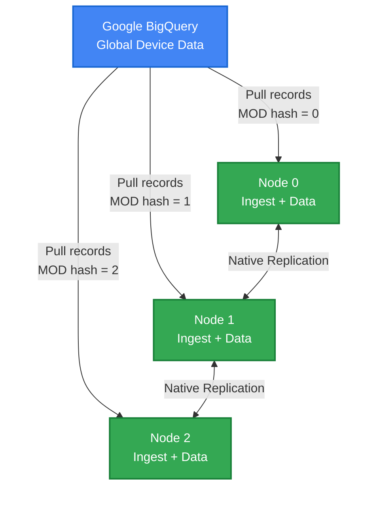

# Scaling BigQuery to Harper Ingestion: Why Simple Solutions Don't Work and What Does

_How we evolved from a single-process bottleneck to a distributed architecture that scales linearly_

**About Harper:** Harper is a distributed application platform that unifies database, cache, and application server into a single system. [Learn more at harperdb.io](https://harperdb.io)

---

## The Challenge

We had a seemingly straightforward problem: sync a massive, real-time dataset from Google BigQuery into Harper. The data comes from a global network of devices updating continuously. Simple enough, right?

Turns out, the "obvious" solutions don't scale. Here's what we learned.

---

## Acceptance Criteria

For this ingestion system to be production-ready, it must meet the following criteria:

1. **Multiple Table Support:** The system must be able to pull data from multiple BigQuery tables simultaneously, allowing for comprehensive data synchronization across different data sources.

2. **Column Selection:** Users must be able to choose specific columns from each table to ingest, rather than being forced to pull entire table schemas. This enables efficient data transfer and storage optimization.

3. **Multiple Ingestors per Instance:** The system must support running more than one ingestor process per Harper instance, allowing different ingestion jobs to operate concurrently on the same infrastructure.

---

## Testing with Synthetic Data: Maritime Vessel Synthesizer

To validate this ingestion system at scale without production data, we developed the **Maritime Vessel Data Synthesizer**—a companion tool that writes realistic test data directly to BigQuery.

### Why We Built This

Testing distributed ingestion requires:

- **Realistic data volume**: Millions of records to validate performance
- **Continuous generation**: Real-time ingestion patterns
- **Predictable patterns**: Known data for validation
- **No production access**: Test without connecting to real customer data

### What It Does

The synthesizer generates realistic maritime vessel tracking data:

**Scale:**

- 100,000+ vessels with persistent identities (MMSI, IMO numbers)
- 144,000+ position updates per day (default configuration)
- Global coverage across 29 major ports
- Configurable from 1,440 to 1.44M records/day

**Realism:**

- 6 vessel types (container ships, tankers, bulk carriers, cargo, passenger, fishing)
- Physics-based movement using Haversine distance calculations
- Port-to-port journeys with realistic speeds (10-25 knots depending on type)
- Navigation statuses ("Under way using engine", "At anchor", "Moored")
- Weighted port traffic (Singapore, Rotterdam, Shanghai busier than smaller ports)

**Data Structure** (actual generated record):

```json
{
	"timestamp": "2025-11-07T16:30:00.000Z",
	"mmsi": "367123456",
	"imo": "IMO9876543",
	"vessel_name": "MARITIME VOYAGER",
	"vessel_type": "Container Ship",
	"latitude": 37.7749,
	"longitude": -122.4194,
	"speed_knots": 12.5,
	"heading": 275,
	"status": "Under way using engine"
}
```

### Integration with Plugin

The synthesizer and plugin share configuration via `config.yaml`:

```yaml
bigquery:
  projectId: your-project-id
  dataset: maritime_tracking # Same dataset/table by default
  table: vessel_positions
  credentials: service-account-key.json

# Optional: override target for synthesizer
synthesizer:
  # dataset: test_data            # Uncomment to use different dataset
  batchSize: 100 # Positions per batch
  generationIntervalMs: 60000 # 60 seconds between batches
  retentionDays: 30 # Auto-cleanup after 30 days
```

**By default**, the synthesizer writes to the same BigQuery table the plugin reads from—perfect for testing end-to-end.

### Key Features

**Rolling Window Mode:**

- `npx maritime-data-synthesizer start` - Automatically maintains N-day data window
- Self-healing: Restarts detect gaps and backfill automatically
- No manual management after initial setup

**Data Management:**

- `initialize N` - Load N days of historical data
- `clear` - Truncate data (keeps table schema)
- `reset N` - Delete and reload with N days
- Automatic retention cleanup every 24 hours

**Testing Workflows:**

1. **Load Testing**: `initialize 60` loads 60 days (~8.6M records) in ~2 hours
2. **Continuous Ingestion**: `start` maintains rolling window for real-time sync validation
3. **Quick Resets**: `clear` empties table in ~10 seconds for fresh test runs

See [QUICKSTART.md](QUICKSTART.md) for complete usage guide.

---

## Attempt 1: The Single Process Bottleneck

The first implementation was textbook simple:

```
LOOP forever:
  changes = query BigQuery for new records
  FOR each record in changes:
    write record to Harper cluster (DNS load balanced)
  END FOR
  checkpoint last timestamp
END LOOP
```

**What we liked:**

- Dead simple to implement
- Easy to reason about
- Single checkpoint to track
- DNS load balancing distributes writes across Harper nodes

**What broke:**

- **The bottleneck is pulling FROM BigQuery, not writing TO Harper.** DNS round-robin solved the wrong problem
- One process = one BigQuery API client = one set of rate limits
- Limited to a single machine's CPU, memory, and network for the pull operation
- No parallelism—only one BigQuery query running at a time
- Adding Harper nodes increased write capacity but didn't help the ingest bottleneck
- Single point of failure

This lasted about 30 minutes in development before we abandoned it.

**Lesson:** Distribution has to start at the SOURCE, not just the destination. Harper could handle the writes; BigQuery ingestion couldn't keep up.

---

## Attempt 2: Multiple Processes with a Global Lock

The next idea: run the same ingest process on multiple Harper nodes, but coordinate with a lock.

```
LOOP forever:
  lock = try acquire global lock
  IF lock acquired:
    changes = query BigQuery for new records
    FOR each record in changes:
      write record to local Harper
    END FOR
    checkpoint last timestamp
    release lock
  ELSE:
    wait and retry
  END IF
END LOOP
```

We could implement the lock in a Harper table, Redis, or ZooKeeper.

**What we liked:**

- Multiple nodes meant automatic failover
- If the active node dies, another picks up
- Solves the single process bottleneck from v1
- **Prevents wasted work:** Without the lock, all nodes would pull the same data from BigQuery (wasting query costs) and write duplicates to Harper (wasting IOPS, even though primary keys dedupe)

**What we hated:**

- **Only one node pulling at a time—no actual parallelism**
- **The "simple" lock is deceptively complex:**
  - Which node gets the lock? (requires consensus)
  - How do we detect when the lock holder crashed vs. just being slow?
  - What if network partitions and two nodes both think they have the lock? (split-brain)
  - Timeout tuning: too short = false failures, too long = long outages
  - Zombie processes with stale locks corrupting data
- **The lock service becomes a critical dependency:** Redis/ZK failure stops everything
- **Still doesn't scale throughput:** Adding nodes provides only redundancy, not performance
- **Lock contention overhead:** Nodes compete for locks instead of ingesting data

**The trade-off:** V2 chooses correctness (preventing duplicate work) over performance (parallel throughput). The lock saves BigQuery costs and wasted writes but costs us scalability and operational complexity.

This felt like we were fighting the system. We distributed the architecture to enable parallel work, then added a lock to prevent parallel work.

**Lesson:** Coordination is expensive, and locks that seem "lightweight" require solving hard distributed systems problems. If you're spending cycles on who gets to work, you're not working. The real question: can we get both correctness AND parallelism?

---

## Attempt 3: Modulo-Based Partitioning (The Solution)

The breakthrough: **what if each node independently knows which records it should ingest?**

### The Core Idea

Each record has a timestamp. Hash that timestamp and take modulo by cluster size:

```javascript
const nodeId = hash(record.timestamp) % clusterSize;
```

If you're node 0 in a 3-node cluster, you only pull records where `hash(timestamp) % 3 == 0`.

**The beauty:** No coordination needed. Each node independently queries BigQuery for just its partition:

```sql
SELECT *
FROM `project.dataset.table`
WHERE MOD(ABS(FARM_FINGERPRINT(CAST(timestamp AS STRING))), 3) = 0
  AND timestamp > @lastCheckpoint
ORDER BY timestamp ASC
LIMIT 1000
```

Node 0 uses `= 0`, node 1 uses `= 1`, node 2 uses `= 2`.

### How It Works End-to-End

**1. Node Discovery**

Each Harper node discovers its peers using Harper's native clustering information.

**Actual implementation** (`src/sync-engine.js:68-101`):

```javascript
async discoverCluster() {
  // Build node ID from hostname and worker index
  const currentNodeId = [server.hostname, server.workerIndex].join('-');

  // Get cluster nodes from server.nodes if available
  let nodes;
  if (server.nodes && Array.isArray(server.nodes) && server.nodes.length > 0) {
    nodes = server.nodes.map(node => `${node.hostname}-${node.workerIndex || 0}`);
  } else {
    // Single-node mode
    nodes = [currentNodeId];
  }

  // Sort deterministically (lexicographic)
  nodes.sort();

  // Find our position
  const nodeIndex = nodes.findIndex(n => n === currentNodeId);

  return {
    nodeId: nodeIndex,      // Position in sorted array (0-based)
    clusterSize: nodes.length,
    nodes: nodes
  };
}
```

**Key points:**

- Node ID is `hostname-workerIndex` (e.g., `node1-0`, `node2-0`)
- Deterministic lexicographic sorting ensures all nodes agree on partition assignments
- Falls back to single-node mode if `server.nodes` is empty
- `nodeId` is the index (0-based) in the sorted node array

**Fabric advantage:** On [Fabric](https://fabric.harper.fast), clustering is automatic - `server.nodes` is automatically populated with cluster topology.

**2. Partitioned Polling**

Each node polls BigQuery for only its partition. The modulo happens in BigQuery, so we're not pulling unnecessary data.

**Actual implementation** (`src/bigquery-client.js:34-52`):

```javascript
async pullPartition({ nodeId, clusterSize, lastTimestamp, batchSize }) {
  const query = `
    SELECT *
    FROM \`${this.dataset}.${this.table}\`
    WHERE
      -- guard + normalize types
      CAST(@clusterSize AS INT64) > 0
      AND CAST(@nodeId AS INT64) BETWEEN 0 AND CAST(@clusterSize AS INT64) - 1
      -- sharding: MOD based on timestamp microseconds
      AND MOD(UNIX_MICROS(${this.timestampColumn}), CAST(@clusterSize AS INT64)) = CAST(@nodeId AS INT64)
      -- time filter
      AND ${this.timestampColumn} > TIMESTAMP(@lastTimestamp)
    ORDER BY ${this.timestampColumn} ASC
    LIMIT CAST(@batchSize AS INT64)
  `;

  const [rows] = await this.client.query({
    query,
    params: { nodeId, clusterSize, lastTimestamp, batchSize }
  });

  return rows;
}
```

**Why `UNIX_MICROS` instead of `FARM_FINGERPRINT`?**

- Deterministic: Same timestamp always maps to same partition
- Fast: Integer modulo is cheaper than string hashing
- Chronological distribution: Adjacent timestamps spread across nodes (better for time-series data)

**3. Local Writing with Checkpoints**

Each node writes to its local Harper instance and updates a checkpoint.

**Actual implementation** (`src/sync-engine.js:299-387, 389-416`):

```javascript
async ingestRecords(records) {
  const validRecords = [];
  const timestampColumn = this.config.bigquery.timestampColumn;

  for (const record of records) {
    // Convert BigQuery types to JavaScript primitives
    const convertedRecord = this.convertBigQueryTypes(record);

    // Validate timestamp exists
    if (!convertedRecord[timestampColumn]) {
      await this.logSkippedRecord(convertedRecord, `missing_${timestampColumn}`);
      continue;
    }

    // Remove 'id' from BigQuery if it exists (Harper auto-generates)
    const { id: _unusedId, ...cleanedRecord } = convertedRecord;

    // Store BigQuery record as-is with metadata
    const mappedRecord = {
      ...cleanedRecord,     // All BigQuery fields at top level
      _syncedAt: new Date() // Sync timestamp metadata
    };

    validRecords.push(mappedRecord);
  }

  // Batch write using Harper transaction
  if (validRecords.length > 0) {
    transaction((txn) => {
      for (const rec of validRecords) {
        tables.BigQueryData.create(rec); // Harper auto-generates id
      }
    });
  }
}

async updateCheckpoint(records) {
  const lastRecord = records.at(-1);
  const timestampColumn = this.config.bigquery.timestampColumn;
  const lastTimestamp = lastRecord[timestampColumn];

  this.lastCheckpoint = {
    nodeId: this.nodeId,
    lastTimestamp: lastTimestamp instanceof Date ? lastTimestamp.toISOString() : String(lastTimestamp),
    recordsIngested: this.lastCheckpoint.recordsIngested + records.length,
    lastSyncTime: new Date().toISOString(),
    phase: this.currentPhase,
    batchSize: this.calculateBatchSize()
  };

  await tables.SyncCheckpoint.put(this.lastCheckpoint);
}
```

**Key differences from naive approach:**

- Uses Harper's `transaction()` for atomic batch writes
- Harper auto-generates primary key `id` - we don't manually create it
- All BigQuery columns stored at top level (no nested `data` field)
- Type conversion for BigQuery-specific types (BigInt, DateTime, etc.)
- Checkpoint includes phase and batch size for monitoring

**4. Native Replication**

Harper's clustering automatically replicates data across all nodes ([see replication docs](https://docs.harperdb.io/docs/developers/replication)). We don't implement replication—Harper does it natively.

### Adaptive Batch Sizing

We don't use a fixed batch size. Instead, we adapt based on sync phase.

**Actual implementation** (`src/sync-engine.js:224-242`):

```javascript
calculateBatchSize() {
  let batchSize;
  switch(this.currentPhase) {
    case 'initial':
      batchSize = this.config.sync.initialBatchSize || 10000;
      break;
    case 'catchup':
      batchSize = this.config.sync.catchupBatchSize || 1000;
      break;
    case 'steady':
      batchSize = this.config.sync.steadyBatchSize || 500;
      break;
    default:
      batchSize = 1000;
  }
  return batchSize;
}
```

**Phase Determination** (`src/sync-engine.js:418-442`):

The system automatically transitions between phases based on lag:

```javascript
async updatePhase() {
  // Calculate lag in seconds
  const now = Date.now();
  const lastTimestamp = new Date(this.lastCheckpoint.lastTimestamp).getTime();
  const lagSeconds = (now - lastTimestamp) / 1000;

  // Update phase based on lag thresholds
  if (lagSeconds > (this.config.sync.catchupThreshold || 3600)) {
    this.currentPhase = 'initial';   // > 1 hour behind: 10K batch
  } else if (lagSeconds > (this.config.sync.steadyThreshold || 300)) {
    this.currentPhase = 'catchup';   // > 5 min behind: 1K batch
  } else {
    this.currentPhase = 'steady';    // Near real-time: 500 batch
  }
}
```

**Configuration** (`config.yaml`):

```yaml
sync:
  initialBatchSize: 10000 # Fast catch-up when hours behind
  catchupBatchSize: 1000 # Moderate pace when minutes behind
  steadyBatchSize: 500 # Small frequent polls when near real-time
  catchupThreshold: 3600 # 1 hour (seconds)
  steadyThreshold: 300 # 5 minutes (seconds)
```

This means initial sync is fast (large batches), and steady-state is efficient (small, frequent polls).

---

## The Architecture

Here's what the final system looks like:



**Each node independently:**

- Discovers cluster topology
- Calculates which partition it owns
- Polls BigQuery for its partition only
- Writes data locally
- Relies on Harper's native replication (each node replicates with all others)

---

## Why This Works

### No Coordination Overhead

Nodes don't talk to each other for ingestion. No locks, no leader election, no consensus. Just independent, parallel work.

### Linear Scalability

Need more throughput? Add nodes. Each node handles 1/n of the data:

- 3 nodes = 3x throughput
- 6 nodes = 6x throughput

### Independent Failure Recovery

If a node crashes:

- Other nodes keep running
- Crashed node restarts from its last checkpoint
- No cluster-wide impact

### Predictable Performance

No variable coordination latency. Each node's performance is deterministic based on its partition size and BigQuery response time.

---

## The Trade-Off: Node Stability

The one downside: **cluster topology must be relatively stable.**

If you add or remove nodes, the modulo changes:

- Old: `hash(ts) % 3`
- New: `hash(ts) % 4`

Same timestamp now maps to a different node.

### Making It Production-Ready

Here's how we handle this to build a robust system:

**1. Durable Node Identity**

The system gets resilience from Harper's built-in durable node identity:

- **`server.hostname`**: Instance identifier (e.g., `node-001`, `node-002`)
- **`server.workerIndex`**: Unique thread ID per instance (0, 1, 2, etc.)
  - Durable across process restarts, stops, and starts
  - Each thread maintains the same `workerIndex` consistently

**Node ID formula:** `${hostname}-${workerIndex}` (e.g., `node-001-0`, `node-001-1`, `node-002-0`)

**Why this works:**

- If `node-001` thread 0 crashes and restarts, it comes back as `node-001-0` again
- Same node ID = same partition assignment = continues from checkpoint
- No manual configuration needed - Harper's runtime provides this automatically

This means each ingestion thread has a stable, persistent identity that survives:

- Process crashes
- Rolling updates
- Planned maintenance
- Container restarts (as long as hostname is stable)

**2. Overprovision Capacity**

Size the cluster for 2x peak load to avoid topology changes:

```
Required nodes = (peak_records/sec × 4 IOPS) / node_IOPS_capacity
Deployed nodes = required_nodes × 2
```

Plan capacity quarterly, make changes during maintenance windows.

**3. Implement Comprehensive Monitoring**

Essential alerts:

- **Drift alert:** `|bigquery_count - harper_count| > 1000` for 5+ minutes
- **Lag alert:** Behind BigQuery by >30 minutes
- **Dead node alert:** No checkpoint update in 5 minutes
- **Phase dashboard:** Track which nodes are catching up vs. steady-state

**4. Document Operational Procedures**

- Node addition runbook (requires brief pause for rebalancing)
- Failure recovery procedures (node crash, network partition, BigQuery timeout)
- Quarterly capacity reviews

**5. Test Recovery Regularly**

Monthly chaos engineering:

- Kill random nodes, verify recovery from checkpoint
- Force restarts to validate checkpoint integrity
- Inject data corruption to test drift detection

**The Result:** A production-grade system that accepts semi-static topology as a design constraint rather than fighting it.

### Future Enhancement: Automatic Rebalancing

We could implement a rebalancing protocol:

1. Detect topology change
2. Pause all nodes briefly
3. Recalculate partitions
4. Resume with new assignments

Not needed yet, but on the roadmap if dynamic scaling becomes essential.

---

## Validation and Monitoring

### Validation Evolution: V1 to V2

**V1 Approach: Count-Based Validation (Initial Implementation)**

The original validation compared record counts between BigQuery and Harper:

```javascript
const bqCount = await bigquery.query('SELECT COUNT(*) FROM table WHERE partition = @nodeId');
const harperCount = await harper.count('table');
const delta = Math.abs(bqCount - harperCount);
const status = delta < 100 ? 'ok' : 'drift';
```

**Why V1 Failed:**

1. **Eventual consistency:** Harper uses an eventually consistent model. Counts on a single node don't reflect cluster-wide state immediately after writes.
2. **Count estimates:** Harper's `count()` returns estimates optimized for performance, not precision. The estimate range can be large and varies between requests.
3. **Replication lag:** Records written locally may not be replicated to all nodes instantly, causing temporary count discrepancies.
4. **False positives:** Validation would fire alerts during normal operation due to estimate variance, not actual data loss.

**V2 Approach: Progress & Spot-Check Validation (Current)**

Instead of comparing estimates, validate what matters: is ingestion progressing and are records actually present?

Three complementary approaches:

**1. Checkpoint Progress Monitoring**

```javascript
// Monitor that ingestion is progressing
const checkpoint = await tables.SyncCheckpoint.get(nodeId);
const timeSinceLastSync = Date.now() - new Date(checkpoint.lastSyncTime);
const lagSeconds = (Date.now() - new Date(checkpoint.lastTimestamp)) / 1000;

// Alert if stalled for 10+ minutes
if (timeSinceLastSync > 600000) {
	alert('Ingestion stalled');
}
```

**2. Smoke Test Queries**

**Actual implementation** (`src/validation.js:115-159` - currently disabled):

```javascript
async smokeTest() {
  const fiveMinutesAgo = new Date(Date.now() - 300000).toISOString();

  // Can we query recent data?
  const recentRecords = await tables.BigQueryData.search({
    conditions: [{ timestamp: { $gt: fiveMinutesAgo } }],
    limit: 1,
    orderBy: 'timestamp DESC'
  });

  if (recentRecords.length === 0) {
    return {
      status: 'no_recent_data',
      message: 'No records found in last 5 minutes'
    };
  }

  const latestRecord = recentRecords[0];
  const recordLagSeconds = (Date.now() - new Date(latestRecord.timestamp).getTime()) / 1000;

  return {
    status: 'healthy',
    latestTimestamp: latestRecord.timestamp,
    lagSeconds: recordLagSeconds,
    message: `Latest record is ${Math.round(recordLagSeconds)}s old`
  };
}
```

**3. Record Spot Checking**

⚠️ **Note**: Full validation is not yet implemented. The validation subsystem exists in `src/validation.js` but is currently commented out in `src/resources.js` and `src/index.js`. This will be completed in v1.0.

Planned validation approach:

```javascript
// Verify Harper records exist in BigQuery
const harperSample = await tables.BigQueryData.search({ limit: 5 });

for (const record of harperSample) {
	const exists = await bigquery.query(
		`
    SELECT 1 FROM \`dataset.table\`
    WHERE timestamp = @ts AND id = @id LIMIT 1
  `,
		{ ts: record.timestamp, id: record.id }
	);

	if (!exists) {
		// Phantom record: exists in Harper but not in BigQuery
	}
}
```

### Key Metrics

- **Lag:** How far behind BigQuery (seconds)
- **Throughput:** Records/second per node
- **Phase:** Initial sync, catch-up, or steady-state
- **Checkpoint freshness:** Time since last checkpoint update
- **Spot check results:** Records validated vs. mismatches found
- **Error rate:** Failed batches per minute

---

## Implementation Highlights

### Schema Design

**Actual schema** (`schema/harper-bigquery-sync.graphql`):

```graphql
# Main data table
# BigQuery records are stored as-is with metadata fields
# Harper auto-generates 'id' field if not provided
type BigQueryData @table {
	id: ID @primaryKey
	# All BigQuery fields stored directly at top level
	# Metadata fields:
	# _syncedAt: Date @createdTime
}

# Per-node checkpoint
type SyncCheckpoint @table {
	nodeId: Int! @primaryKey
	lastTimestamp: Date!
	recordsIngested: Long!
	lastSyncTime: Date!
	phase: String!
	batchSize: Int!
}

# Audit log for validation/errors
type SyncAudit @table {
	id: ID! @primaryKey
	timestamp: Date! @indexed @createdTime
	nodeId: Int
	bigQueryCount: Long
	harperCount: Long
	delta: Long
	status: String!
	reason: String
	recordSample: String
}
```

**Key differences from naive schema:**

- `BigQueryData` is generic - all BigQuery columns stored at top level (no predefined fields)
- Checkpoint includes `lastSyncTime`, `phase`, and `batchSize` for monitoring
- Audit table flexible - supports both validation and error logging
- Uses `Date` type (not `String`) for timestamps

### Error Handling

**Current implementation** (`src/sync-engine.js:176-222`):

```javascript
async runSyncCycle() {
  try {
    const batchSize = this.calculateBatchSize();

    // Pull records for this node's partition
    const records = await this.client.pullPartition({
      nodeId: this.nodeId,
      clusterSize: this.clusterSize,
      lastTimestamp: this.lastCheckpoint.lastTimestamp,
      batchSize
    });

    if (records.length === 0) {
      this.currentPhase = 'steady';
    } else {
      // Write to Harper
      await this.ingestRecords(records);

      // Update checkpoint
      await this.updateCheckpoint(records);

      // Update phase based on lag
      await this.updatePhase();
    }
  } catch (error) {
    logger.error(`Sync cycle error: ${error.message}`, error);
    // Continue despite errors - don't crash the component
  } finally {
    // Schedule next poll
    this.schedulePoll();
  }
}
```

**Error handling strategy:**

- Errors logged but don't crash the process
- Failed cycle retries on next scheduled poll (interval-based retry)
- Checkpoint preserved from last successful batch
- ⚠️ **TODO**: Add exponential backoff for transient BigQuery errors

### Missing Data Handling

**Actual implementation** (`src/sync-engine.js:306-316`):

```javascript
for (const record of records) {
	// Validate timestamp exists
	if (!convertedRecord[timestampColumn]) {
		logger.warn(`Missing timestamp column '${timestampColumn}', skipping record`);
		await this.logSkippedRecord(convertedRecord, `missing_${timestampColumn}`);
		continue;
	}

	// Process valid record
	validRecords.push(mappedRecord);
}
```

**Skipped record logging** (`src/sync-engine.js:450-468`):

```javascript
async logSkippedRecord(record, reason) {
  const auditEntry = {
    id: `skip-${Date.now()}-${Math.random().toString(36).substr(2, 9)}`,
    timestamp: new Date(),
    status: 'skipped',
    reason: reason,
    recordSample: JSON.stringify(record).substring(0, 500)
  };
  await tables.SyncAudit.put(auditEntry);
}
```

Skipped records are logged to `SyncAudit` table for monitoring and debugging.

---

## Expected Performance

### Throughput (Projected)

With 3 nodes on modest hardware:

- **Steady-state:** ~15,000 records/second total (5,000 per node)
- **Catch-up:** ~30,000 records/second (10,000 per node)

### Latency (Projected)

- **Lag in steady state:** <30 seconds
- **Initial sync:** ~6 hours for 100M records
- **Catch-up from 1 hour lag:** ~10 minutes

### IOPS Usage (Estimated)

With 2 indexes per table:

- ~4 IOPS per record
- 5,000 records/sec per node = ~20,000 IOPS
- SSD handles this comfortably

⚠️ **Note**: These are projected performance numbers based on architecture design. Actual performance will vary based on:

- BigQuery query response times
- Network latency between BigQuery and Harper
- Record size and structure
- Hardware specifications (CPU, memory, disk I/O)
- Harper cluster configuration

---

## Lessons Learned

### 1. Distribution Beats Coordination

Every minute spent coordinating is a minute not working. Eliminate coordination wherever possible.

### 2. Deterministic Partitioning is Powerful

If every node can independently calculate the right answer, you don't need to communicate.

### 3. Leverage Native Capabilities

Harper's clustering and replication are production-tested. Don't reimplement them.

### 4. Adaptive Behavior Matters

Static batch sizes waste resources during steady-state or leave performance on the table during catch-up.

### 5. Trade-offs are Okay

Node stability vs. flexibility is acceptable. Most systems don't need dynamic scaling every minute.

---

## When to Use This Pattern

**Good fit:**

- Large datasets with continuous updates
- Need for horizontal scalability
- Relatively stable cluster topology
- Source system supports partitioned queries

**Not ideal:**

- Extremely dynamic cluster sizes (Note: Harper doesn't support autoscaling—nodes must be added/removed manually with rebalancing consideration)
- Need for strong consistency across nodes immediately
- Source doesn't support efficient partitioned queries

---

## Conclusion

Distributed ingestion doesn't require complex coordination protocols. With deterministic partitioning, each node can work independently while the system scales linearly. The key insight: **make the partition assignment a pure function of the data, not a stateful coordination process.**

This pattern isn't specific to BigQuery and Harper—it applies anywhere you need to ingest large-scale data into a distributed system. The modulo-based approach is simple, predictable, and scales beautifully.

Sometimes the best distributed algorithm is no coordination at all.

---

## References

- [HarperDB Documentation](https://docs.harperdb.io)
- [Harper Clustering Documentation](https://docs.harperdb.io/docs/developers/replication)
- [Harper Fabric](https://fabric.harper.fast)
